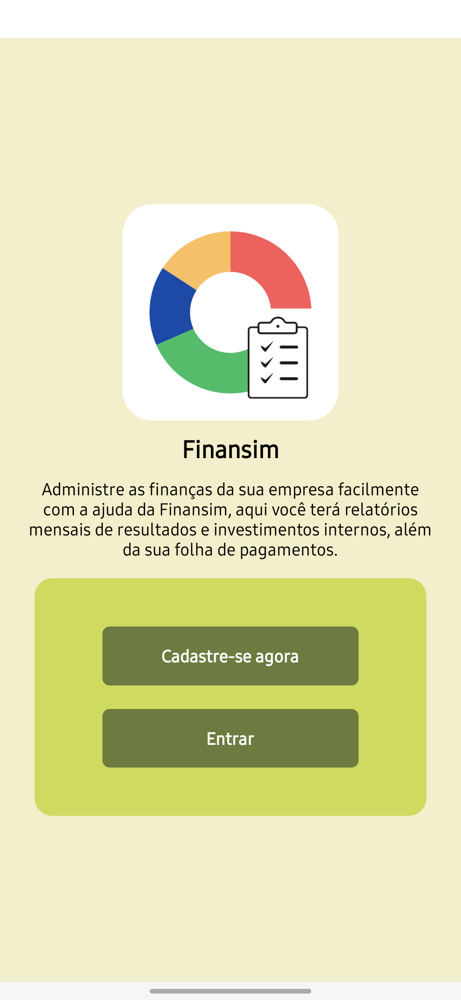

# Projeto Integrador Desenvolvimento Móvel - Finansim

## Objetivo da aplicação:

Facilitar o controle de gastos e resultados de uma empresa, que irá cadastrar seus setores, registrar seus números e ver relatórios sobre o estado financeiro atual da empresa, com o foco em três categorias: Vendas, Compras e Pagamentos.

## Ícone:


## Capturas de tela:



## Descrição Técnica:

Aplicativo Expo React Native para a plataforma Android que usa JavaScript como sua linguagem principal e os serviços de banco de dados e autenticação do Firebase, podendo fazer operações de criação, leitura em tempo real, edição e exclusão de documentos no Firestore e criação, entrada e saída de usuários pela autenticação.

Feito como projeto final do meu curso técnico de Informática para Internet.

>[!IMPORTANT]
> Consulte o arquivo ```requirements.txt``` para saber as bibliotecas e dependencias usadas.
>
> Não é possível rodar o app pela web, pois ele usa funções nativas do sistema, como a persistência de dados do React Native na inicialização do autenticador do Firebase e o componente Alert do React Native.

## Estado atual:

Resumo: App quase completamente finalizado, ainda tem alguns bugs. Do projeto falta terminar a documentação e revisar e comentar o código.

Documentação e protótipo do Figma inicialmente prontos, sendo necessário atualizar a documentação para refletir o estado atual do app e colocá-la em linguagem técnica.

Navegação de telas por stack e tab navigation

Passagem de parâmetros entre telas e componentes próprios

Autenticação por email e senha pelo Firebase

CRUD completo pelo Firebase Firestore, com a exibição condicionada para usuários autenticados

Conexão com a API Via CEP para complementar o cadastro

Estilização total das telas

Última atualização da documentação: 03/10

## O que falta implementar:

Corrigir os bugs

>[!WARNING]
> Dois bugs foram identicados atualmente:
>
> As vezes na hora de criar um registro no banco ou exibir uma tela de relatórios surge um erro dizendo que strings tem que ser exibidas dentro de um componente text, mesmo não tendo uma string visivelmente solta no código.
>
> Se o usuário encerrar sua sessão e entrar com outra conta, ainda poderá ver os dados da sessão anterior nas telas dos relatórios, inclusive podendo alterá-los, com isso provavelmente sendo um problema de cache.

## Protótipo no Figma
[Figma](https://www.figma.com/design/s2pnA0seBIVWfZWlOaJChV/App-de-Finan%C3%A7as?node-id=0-1&t=19tIYorPdagTO9BV-1)

## Link de download da build Preview
[Expo EAS](https://expo.dev/accounts/sanallite/projects/finansim/builds/52074419-4e6a-42e5-8488-3998f5ce69a3)

## Executando uma build de desenvolvimento

1. Para clonar o repositório clique no botão ```fork``` ou ```code``` e siga as instruções na tela.

2. Instale, caso já não tenha feito o [Node.js](https://nodejs.org/pt) que também inclui o npm (Node Package Manager).

3. Apague o arquivo ```eas.json``` e o objeto ```"eas"``` dentro do objeto ```"extra"``` no arquivo ```app.json```. Elfazem referência ao projeto em outra conta do Expo.

4. Instale globalmente o [eas-cli](https://docs.expo.dev/get-started/set-up-your-environment/?platform=android&device=physical&mode=development-build) seguindo as instruções para fazer login ou criar uma conta no Expo Application Services, apenas configurando um projeto seu sem fazer uma build de Desenvolvimento ainda.

5. Instale as dependencias necessárias, listadas no arquivo ```package.json``` utilizando ```npx expo install``` para garantir a compatibilidade com a versão do Expo.

6. Siga as instruções da [documentação do Expo](https://docs.expo.dev/get-started/set-up-your-environment/?platform=android&device=physical&mode=development-build) para configurar um ambiente de desenvolvimento Android.
Você pode instalar a build em um dispositivo físico ou no emulador de dispositivo do Android Studio, o Virtual Device.

7. Inicie um servidor de desenvolvimento para começar a rodar o projeto com ```npx expo start```

>[!WARNING]
>
> Ainda não testei esse processo de instalação...
